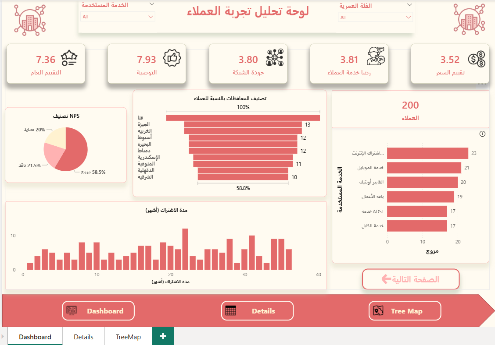
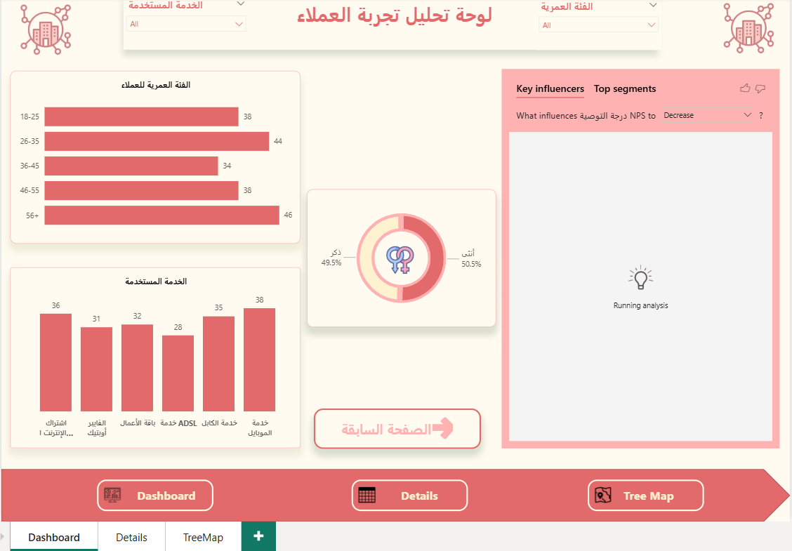
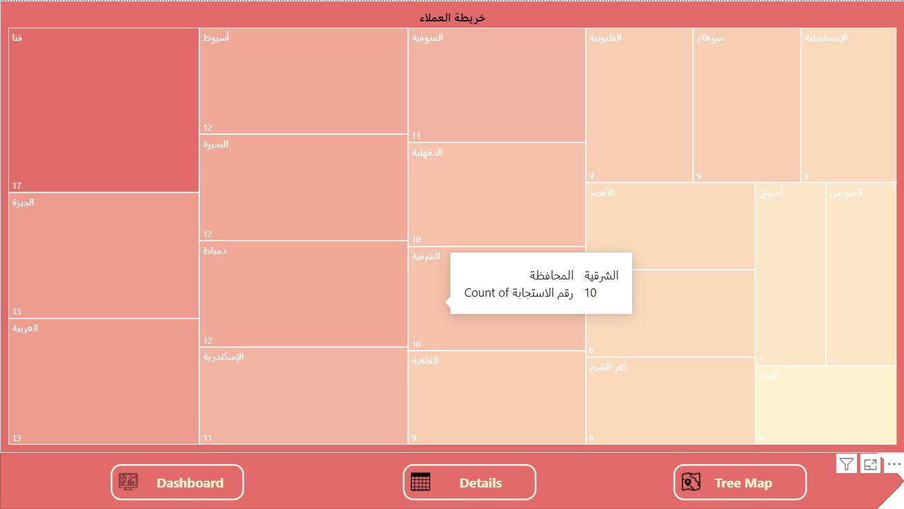

# Customer Satisfaction Dashboard | Power BI

## Dashboard Preview

### Overview

### Customer Details

### Treemap Analysis

---

## Project Overview

This Power BI project analyzes customer survey data to measure customer satisfaction, evaluate service quality, and uncover the key factors influencing customer recommendations.

The dashboard transforms raw survey responses into actionable business insights, enabling data-driven decision-making and customer experience improvement.

---

## Business Problem

Organizations collect large volumes of customer feedback, but identifying meaningful patterns and improvement opportunities can be challenging.

This dashboard helps answer key business questions such as:

* How satisfied are customers overall?
* Which customer segments report the highest satisfaction levels?
* What factors influence customer recommendations?
* How does satisfaction vary across demographics and regions?

---

## Tools & Technologies

* Power BI
* Power Query
* DAX
* Data Modeling
* Data Visualization

---

## Dashboard Features

* Customer Satisfaction Analysis
* Net Promoter Score (NPS) Tracking
* Customer Segmentation by Age and Gender
* Regional Performance Analysis
* Service-Based Satisfaction Analysis
* Interactive Filters and Drill-Down Functionality
* Key Influencers Analysis

---

## Key Metrics

* Overall Customer Rating
* Customer Service Satisfaction
* Network Quality Satisfaction
* Pricing Satisfaction
* NPS Score
* Total Survey Responses

---

## Key Skills Demonstrated

* Data Cleaning & Transformation
* Data Modeling
* DAX Measures
* KPI Development
* Customer Experience Analytics
* Dashboard Design
* Business Intelligence Reporting

---

## Project Outcome

The dashboard provides a comprehensive view of customer feedback, helping stakeholders identify improvement opportunities, monitor customer satisfaction trends, and support informed business decisions through data-driven insights.

